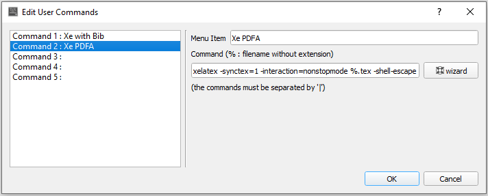

# A (Xe)LaTeX Thesis Template

A (Xe)LaTeX thesis template conforming to Carleton University's thesis formatting guidelines. To be compiled to either PDF or PDF/A.
Tested with `Texmaker` for Windows.

## Regular PDF

Compile order: `XeLaTeX` &rightarrow; `BibTeX` &rightarrow; `XeLaTeX` &rightarrow; `XeLaTeX` &rightarrow; `View PDF`

## PDF/A

As per the [`pdfx` documentation](https://ctan.org/pkg/pdfx), `-shell-escape` needs to be added as an option for XeLaTeX. Instead of
modifying the existing `XeLaTeX` build command, create a new one.

1.  In `Texmaker`, go to `User` &rightarrow; `User Commands` &rightarrow; `Edit User Commands`.

2.  Create a new command like below



by borrowing the default options from `XeLaTeX` (use the `wizard` to auto-populate this field as it may depend on your OS) and
appending 

```
-shell-escape
```

to the end.

New compile order: `XeLaTeX (PDFA)` &rightarrow; `BibTeX` &rightarrow; `XeLaTeX (PDFA)` &rightarrow; `XeLaTeX (PDFA)` &rightarrow;
`View PDF`.

## Differences between `main.tex` and `main-PDFA.tex`

The PDF/A creation is done through the `pdfx` package. As recommended in the documentation, `pdfx` should be the first package
loaded. In addition, `pdfx` loads `hyperref` (and other packages - see [`pdfx` documentation](https://ctan.org/pkg/pdfx) for the
full list), so `\hypersetup` should be used to configure options for `hyperref`. For regular PDFs, the `pdfx` package does not need
to be loaded and `hyperref` can be loaded as usual (with consideration for any other packages that may also load `hyperref`.)

For regular PDFs, metadata can be supplied in the options of `hyperref`. For PDF/A, metadata is supplied through the
`\jobname.xmpdata` file, where `\jobname` is the name of the `.tex` file. See [`pdfx` documentation](https://ctan.org/pkg/pdfx) for
the full list of supported metadata options.
